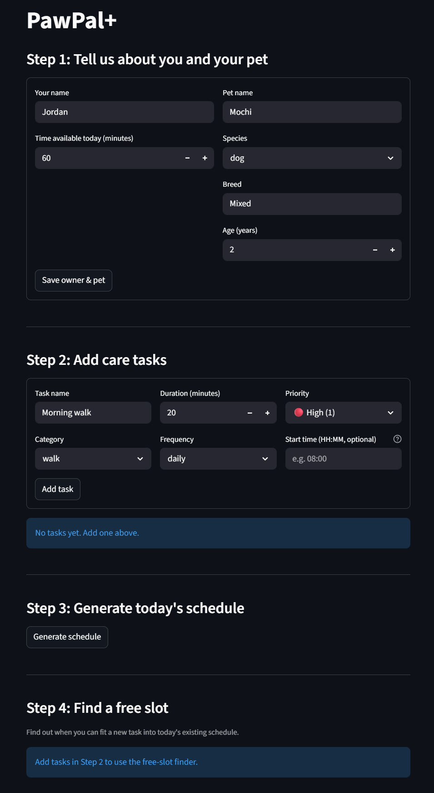

# PawPal+ (Module 2 Project)

**PawPal+** is a Streamlit app that helps a busy pet owner stay on top of daily care. It schedules tasks intelligently, warns about time conflicts, and automatically re-queues recurring activities so nothing gets forgotten.

---

## 📸 Demo



---

## Features

### Owner and pet profiles
Set your name, daily time budget (in minutes), pet name, species, breed, and age. The scheduler uses your time budget as a hard constraint — it never plans more than you have available.

### Priority-based scheduling
Tasks carry a priority level (High / Medium / Low). The daily plan is built greedily: highest-priority tasks are scheduled first, and anything that doesn't fit in the remaining time is surfaced as a "skipped" item with a clear explanation.

### Sorting by time
Any task can be given an optional start time in `HH:MM` format. The task list and the generated schedule both display tasks in chronological order using a `lambda` key sort on the zero-padded time string — no parsing required.

### Filtering
The task list can be narrowed by category (walk, feed, meds, grooming, enrichment) and by status (pending / completed), individually or combined. A separate filter retrieves all tasks for a named pet across a multi-pet household.

### Recurring task automation
Each task carries a frequency (`daily`, `weekly`, or `as-needed`). When you mark a daily or weekly task complete, the scheduler automatically creates the next occurrence using Python's `timedelta` — `+1 day` for daily tasks, `+7 days` for weekly — so recurring care is never manually re-entered.

### Day-of-week recurrence filter
`get_due_tasks(pet, day_of_week)` returns only the tasks due on a given day: daily tasks always appear, weekly tasks appear on Mondays only, and as-needed tasks never auto-populate.

### Conflict detection and warnings
When two scheduled tasks overlap in time, the app surfaces an orange `st.warning` banner **before** the schedule table so the issue is impossible to miss. The interval overlap test (`A.start < B.end AND B.start < A.end`) catches both exact same-time conflicts and partial overlaps. A cross-pet variant checks all pets in the household simultaneously using `itertools.combinations`.

---

### Auto-assign start times *(Challenge 1)*
`Scheduler.auto_assign_times(tasks, day_start)` takes tasks that have no `start_time` and slots them into a conflict-free timeline automatically. It sorts by priority, then walks a time cursor forward: tasks with an existing `start_time` are kept as-is (the cursor advances past their end), and untimed tasks are assigned the current cursor position before the cursor advances by their duration. Original task objects are never mutated — new copies are returned. Exposed in the UI as an **"Auto-assign start times"** expander inside the generated schedule.

### Data persistence *(Challenge 2)*
`Owner.save_to_json(filepath)` and `Owner.load_from_json(filepath)` give the app a memory that survives restarts. The full profile — owner, all pets, all tasks including completion state, start times, and due dates — is serialized to a human-readable `data.json` file using Python's built-in `json` module (no third-party library needed).

The one serialization challenge is `due_date` (`datetime.date` is not JSON-serializable by default). The solution: `to_dict()` converts it to an ISO string (`"2026-03-25"`) and `from_dict()` restores it with `date.fromisoformat()`, preserving the correct Python type on reload.

The Streamlit app auto-saves to `data.json` whenever a profile is created or a task is added. On startup it checks for `data.json` and silently restores the last session — the user lands back exactly where they left off. A corrupted file is caught and ignored so the app always starts cleanly.

#### How Agent Mode was used for Challenge 2
The serialization design was planned before writing any code: the prompt described the round-trip requirement, the `due_date` type problem, and the fallback-on-corruption behaviour in `app.py`. Agent Mode generated `to_dict`/`from_dict` for all three classes plus `save_to_json`/`load_from_json` in a single pass. The auto-save placement in `app.py` (after setup form and after add-task) was a human decision — Agent Mode initially suggested saving on every Streamlit rerun, which would have caused redundant disk writes on every user interaction. The narrower trigger (only on actual data changes) was substituted before committing.

### Find next free slot *(Challenge 1)*
`Scheduler.find_next_slot(tasks, duration_minutes, day_start, day_end)` answers the question "when can I fit one more task?" It converts timed tasks to `(start, end)` minute intervals, merges adjacent or overlapping blocks into contiguous occupied ranges, then scans the gaps for the first one wide enough. Returns the gap's start as `"HH:MM"`, or `None` if the day is full. Exposed as **Step 4: Find a free slot** in the UI.

#### How Agent Mode was used for Challenge 1
The two algorithms were developed in a single Agent Mode session with the full codebase in context. The prompt provided the desired behaviour contract for each method (inputs, outputs, edge cases) before asking for an implementation. Agent Mode generated both methods alongside their docstrings and test stubs in one pass, which was then reviewed against the test plan before any tests were saved. The interval-merging step in `find_next_slot` was an Agent suggestion — the original plan was a simpler scan without merging, but Agent Mode identified that adjacent back-to-back tasks would not be correctly treated as a single block without it, and supplied the merge loop. That suggestion was accepted after manually tracing through the `test_find_next_slot_gap_too_small_skips_to_next` case to confirm correctness.

---

## System architecture

See [`uml_final.png`](uml_final.png) for the full class diagram. Core classes:

| Class | Role |
|---|---|
| `Task` | Data: name, category, duration, priority, frequency, start time, due date |
| `Pet` | Owns a list of `Task` objects; provides pending/all accessors |
| `Owner` | Holds the time budget; owns one or more `Pet` objects |
| `Scheduler` | Logic: greedy plan generation, sorting, filtering, recurrence, conflict detection |

---

## Getting started

### Setup

```bash
python -m venv .venv
source .venv/bin/activate  # Windows: .venv\Scripts\activate
pip install -r requirements.txt
```

### Suggested workflow

1. Read the scenario carefully and identify requirements and edge cases.
2. Draft a UML diagram (classes, attributes, methods, relationships).
3. Convert UML into Python class stubs (no logic yet).
4. Implement scheduling logic in small increments.
5. Add tests to verify key behaviors.
6. Connect your logic to the Streamlit UI in `app.py`.
7. Refine UML so it matches what you actually built.

## Smarter Scheduling

Phase 4 adds four algorithmic features to `Scheduler` in `pawpal_system.py`:

### Sort by time
`Scheduler.sort_by_time(tasks)` orders any task list chronologically using
Python's `sorted()` with a `lambda` key on the `"HH:MM"` `start_time` field.
Zero-padded time strings compare correctly without parsing — tasks without a
`start_time` are placed at the end.

### Filter tasks
`Scheduler.filter_tasks(tasks, category, completed)` returns only the tasks
that match the supplied filters. Pass `None` for any field to skip it.
`Scheduler.filter_by_pet(owner, pet_name)` retrieves all tasks for a single
named pet across the owner's household.

### Recurring tasks
Each `Task` stores a `due_date` (`datetime.date`) and a `frequency`
(`"daily"`, `"weekly"`, or `"as-needed"`).

- `Task.next_occurrence()` uses `timedelta` to compute the next due date and
  returns a fresh, uncompleted copy of the task (`+1 day` or `+7 days`).
- `Scheduler.mark_task_complete(name, pet)` calls `next_occurrence()` after
  marking the task done and automatically adds the result to the pet's task
  list, so future schedule generations include it without manual re-entry.
- `Scheduler.get_due_tasks(pet, day_of_week)` filters to only the tasks due
  on a given day: daily tasks are always included; weekly tasks only on
  Mondays; as-needed tasks never appear automatically.

### Conflict detection
`Scheduler.detect_conflicts(tasks)` finds pairs of tasks whose time windows
overlap using the interval test `A.start < B.end AND B.start < A.end`.

`Scheduler.warn_conflicts(tasks, label)` wraps this in a lightweight layer
that returns human-readable `WARNING:` strings instead of raising exceptions,
so callers check `if warnings:` rather than using try/except.

`Scheduler.warn_cross_pet_conflicts(owner)` pools timed tasks from every pet
in the household and checks all unique pairs with `itertools.combinations`,
labelling each warning with both pet names so the owner knows exactly which
animals have a scheduling clash.

## Testing PawPal+

### Running the tests

```bash
python -m pytest tests/test_pawpal.py -v
```

All 38 tests should pass in under a second.

### What the tests cover

| Area | Tests | What is verified |
|---|---|---|
| `Task.mark_complete` | 2 | Sets `completed = True`; calling twice doesn't crash |
| `Task.next_occurrence` | 5 | Daily → +1 day, weekly → +7 days, as-needed → `None`; result is uncompleted; all attributes preserved |
| `Pet` task management | 3 | Add single/multiple tasks; brand-new pet returns empty lists |
| `Scheduler` core | 5 | Respects time budget; skips tasks that don't fit; orders by priority; handles empty pet; handles all-tasks-exceed-budget |
| Recurring completion | 4 | `mark_task_complete(pet=)` adds next occurrence; correct due date; no recurrence without `pet=`; no recurrence for as-needed |
| `sort_by_time` | 3 | Out-of-order tasks sorted chronologically; untimed tasks placed last; all-untimed list passes through |
| `filter_tasks` / `filter_by_pet` | 5 | Filter by category; by status; combined; correct pet; unknown pet → `[]` |
| `get_due_tasks` | 3 | Daily appears every day; weekly only on Monday; as-needed never appears |
| Conflict detection | 8 | Exact overlap; partial overlap; no overlap; untimed tasks ignored; warning strings contain labels; cross-pet overlap detected; cross-pet no-overlap → `[]` |

### Confidence level

**4 / 5 stars**

The core scheduling behaviors (budget enforcement, priority ordering, recurring
task creation, and conflict detection) are all directly exercised with both
happy-path and edge-case inputs. The one star withheld reflects two gaps that
would need more work before production use:

1. **UI layer** — `app.py` is not tested; Streamlit form interactions are
   outside the scope of this pytest suite.
2. **Concurrent multi-owner scenarios** — the system is stateless per run, so
   shared-state or concurrency bugs are not covered.
