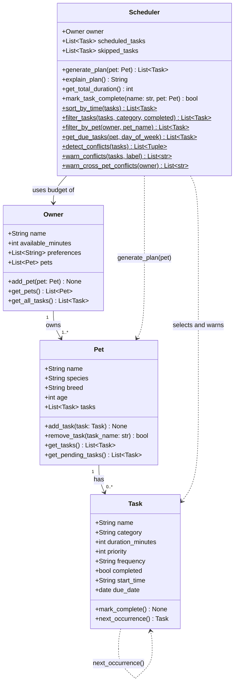

# PawPal+ Project Reflection

## 1. System Design

**a. Initial design**

Three core actions a user should be able to perform:

1. **Enter owner and pet info** — The user provides basic details about themselves and their pet (name, pet type, time available per day, any preferences or constraints). This profile anchors everything the scheduler does — without it, the system has no context for what is reasonable to plan.

2. **Add and edit care tasks** — The user creates tasks representing specific pet care activities (e.g., morning walk, evening feeding, medication, grooming). Each task captures at minimum a duration and a priority level. The user can also edit or remove tasks as the pet's needs change over time.

3. **Generate and view a daily schedule** — The user requests a daily plan. The system selects and orders tasks based on the owner's available time, task priorities, and any other constraints. The resulting schedule is displayed clearly, along with an explanation of why tasks were included or excluded, so the owner understands the reasoning and can trust the plan.

**UML Class Diagram (Mermaid.js)**

- **Owner** holds the owner's name, daily time budget, and preferences. It owns one or more pets.
- **Pet** holds the animal's profile and maintains its list of care tasks.
- **Task** represents a single care activity with a name, category (walk/feed/meds/etc.), duration, and priority.
- **Scheduler** takes an owner and pet, selects feasible tasks within the available time budget (highest priority first), and can explain why tasks were included or excluded.

**Class responsibilities summary:**

- **Task** — pure data class; holds one care activity's details. No awareness of scheduling.
- **Pet** — pure data class; owns a list of tasks and provides access to them.
- **Owner** — pure data class; holds the time budget and owns a list of pets.
- **Scheduler** — logic class; takes an `Owner`, accepts a `Pet` at plan-generation time, selects tasks that fit the time budget (highest priority first), tracks skipped tasks, and explains the plan.

**b. Design changes**

Three changes were made after reviewing the initial skeleton:

1. **Removed `is_feasible()` from `Task`.** The original skeleton put this method on `Task`, but a task shouldn't need to know about available time — that is the scheduler's concern. Putting it on `Task` leaked scheduling logic into a data class. The check now lives inside `Scheduler.generate_plan()`.

2. **`Scheduler` now accepts a `Pet` in `generate_plan(pet)` rather than in `__init__`.** The original design hard-coded a single pet at construction time, which contradicted `Owner` supporting multiple pets. Passing the pet to `generate_plan()` lets one `Scheduler` instance produce plans for any of the owner's pets.

3. **Added `skipped_tasks` list to `Scheduler`.** `explain_plan()` needs to describe why tasks were left out, not just which tasks were included. Without storing the skipped tasks, that explanation would be impossible to produce.

---

## 2. Scheduling Logic and Tradeoffs

**a. Constraints and priorities**

- What constraints does your scheduler consider (for example: time, priority, preferences)?
- How did you decide which constraints mattered most?

**b. Tradeoffs**

**Greedy priority selection does not backtrack.**

`generate_plan()` sorts tasks by priority and adds them one by one until the time budget runs out. If a high-priority task is too long to fit in the remaining time, it is skipped — even if removing a lower-priority task that was already added would free up exactly enough room.

For example: if 15 minutes remain and a P2 task needs 20 minutes, the scheduler skips it. It does not go back and ask "could I drop the P3 task I already added (10 min) to make room?" That backtracking would solve an instance of the 0/1 knapsack problem, which has exponential worst-case complexity.

This tradeoff is reasonable for a pet care app because:
1. **Priority order is usually correct.** A dog's medication (P1) genuinely matters more than a bath (P4). Owners write priorities intentionally, so the greedy result aligns with their intent the vast majority of the time.
2. **Schedules are short.** A typical pet has 5–10 tasks per day. Even an optimal solver would rarely produce a different result than greedy at that scale.
3. **Transparency matters more than optimality.** A pet owner needs to understand and trust their schedule. The greedy approach produces an explanation ("highest priority first, stopped when time ran out") that is easy to reason about. An optimal packing might schedule a surprising combination that the owner cannot easily verify.

The cost is that occasionally a better packing exists but is not found. That is an acceptable tradeoff for clarity and speed in this domain.

---

## 3. AI Collaboration

**a. How you used AI**

- How did you use AI tools during this project (for example: design brainstorming, debugging, refactoring)?
- What kinds of prompts or questions were most helpful?

**b. Judgment and verification**

- Describe one moment where you did not accept an AI suggestion as-is.
- How did you evaluate or verify what the AI suggested?

---

## 4. Testing and Verification

**a. What you tested**

- What behaviors did you test?
- Why were these tests important?

**b. Confidence**

- How confident are you that your scheduler works correctly?
- What edge cases would you test next if you had more time?

---

## 5. Reflection

**a. What went well**

- What part of this project are you most satisfied with?

**b. What you would improve**

- If you had another iteration, what would you improve or redesign?

**c. Key takeaway**

- What is one important thing you learned about designing systems or working with AI on this project?
