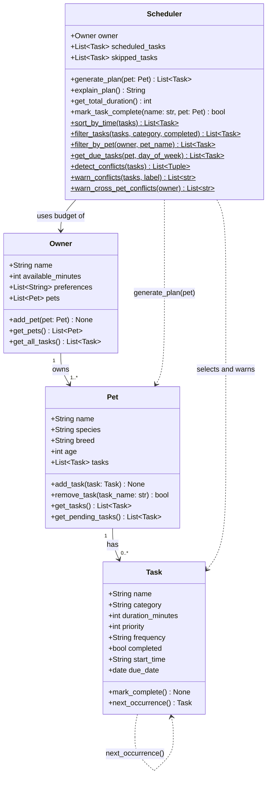

# PawPal+ Project Reflection

## 1. System Design

**a. Initial design**

Three core actions a user should be able to perform:

1. **Enter owner and pet info** — The user provides basic details about themselves and their pet (name, pet type, time available per day, any preferences or constraints). This profile anchors everything the scheduler does — without it, the system has no context for what is reasonable to plan.

2. **Add and edit care tasks** — The user creates tasks representing specific pet care activities (e.g., morning walk, evening feeding, medication, grooming). Each task captures at minimum a duration and a priority level. The user can also edit or remove tasks as the pet's needs change over time.

3. **Generate and view a daily schedule** — The user requests a daily plan. The system selects and orders tasks based on the owner's available time, task priorities, and any other constraints. The resulting schedule is displayed clearly, along with an explanation of why tasks were included or excluded, so the owner understands the reasoning and can trust the plan.

**UML Class Diagram (Mermaid.js)**



- **Owner** holds the owner's name, daily time budget, and preferences. It owns one or more pets.
- **Pet** holds the animal's profile and maintains its list of care tasks.
- **Task** represents a single care activity with a name, category (walk/feed/meds/etc.), duration, and priority.
- **Scheduler** takes an owner and pet, selects feasible tasks within the available time budget (highest priority first), and can explain why tasks were included or excluded.

**Class responsibilities summary:**

- **Task** — pure data class; holds one care activity's details. No awareness of scheduling.
- **Pet** — pure data class; owns a list of tasks and provides access to them.
- **Owner** — pure data class; holds the time budget and owns a list of pets.
- **Scheduler** — logic class; takes an `Owner`, accepts a `Pet` at plan-generation time, selects tasks that fit the time budget (highest priority first), tracks skipped tasks, and explains the plan.

**b. Design changes**

Three changes were made after reviewing the initial skeleton:

1. **Removed `is_feasible()` from `Task`.** The original skeleton put this method on `Task`, but a task shouldn't need to know about available time — that is the scheduler's concern. Putting it on `Task` leaked scheduling logic into a data class. The check now lives inside `Scheduler.generate_plan()`.

2. **`Scheduler` now accepts a `Pet` in `generate_plan(pet)` rather than in `__init__`.** The original design hard-coded a single pet at construction time, which contradicted `Owner` supporting multiple pets. Passing the pet to `generate_plan()` lets one `Scheduler` instance produce plans for any of the owner's pets.

3. **Added `skipped_tasks` list to `Scheduler`.** `explain_plan()` needs to describe why tasks were left out, not just which tasks were included. Without storing the skipped tasks, that explanation would be impossible to produce.

---

## 2. Scheduling Logic and Tradeoffs

**a. Constraints and priorities**

The scheduler considers two hard constraints and one soft constraint:

1. **Time budget (hard)** — the owner's `available_minutes` is an absolute ceiling. No plan will ever exceed it. This was the first constraint implemented because without it the system could produce a schedule a real person cannot execute.

2. **Task priority (hard ordering)** — tasks are sorted by priority number (1 = most important) before the greedy selection loop runs. This means the scheduler always prefers medication over grooming, not because it knows what medication is, but because the owner explicitly said so. Priority was chosen as the primary ordering key because pet care consequences are uneven: a missed medication is harmful, a missed bath is inconvenient.

3. **Task frequency (soft)** — `get_due_tasks()` filters by day of week so weekly tasks only appear on Mondays and as-needed tasks never auto-populate. This is a soft constraint because the owner can override it by adding any task manually regardless of frequency.

Duration was not used as a constraint for sorting (only for budget arithmetic) because sorting by duration would undermine the priority ordering — a quick low-priority task should not displace a long high-priority one.

**b. Tradeoffs**

**Greedy priority selection does not backtrack.**

`generate_plan()` sorts tasks by priority and adds them one by one until the time budget runs out. If a high-priority task is too long to fit in the remaining time, it is skipped — even if removing a lower-priority task that was already added would free up exactly enough room.

For example: if 15 minutes remain and a P2 task needs 20 minutes, the scheduler skips it. It does not go back and ask "could I drop the P3 task I already added (10 min) to make room?" That backtracking would solve an instance of the 0/1 knapsack problem, which has exponential worst-case complexity.

This tradeoff is reasonable for a pet care app because:
1. **Priority order is usually correct.** A dog's medication (P1) genuinely matters more than a bath (P4). Owners write priorities intentionally, so the greedy result aligns with their intent the vast majority of the time.
2. **Schedules are short.** A typical pet has 5–10 tasks per day. Even an optimal solver would rarely produce a different result than greedy at that scale.
3. **Transparency matters more than optimality.** A pet owner needs to understand and trust their schedule. The greedy approach produces an explanation ("highest priority first, stopped when time ran out") that is easy to reason about. An optimal packing might schedule a surprising combination that the owner cannot easily verify.

The cost is that occasionally a better packing exists but is not found. That is an acceptable tradeoff for clarity and speed in this domain.

---

## 3. AI Collaboration

**a. How you used AI**

AI was used across every phase, but the role it played shifted as the project matured:

- **Phase 1 (design)** — used for brainstorming class responsibilities and identifying which methods belonged on which class. The most useful prompt style was constraint-based: "Given that `Task` is a pure data class, which of these methods should live on `Scheduler` instead?" This forced the AI to reason about separation of concerns rather than just generating code.

- **Phase 3–4 (implementation)** — used for generating algorithmic first drafts (sorting, filtering, conflict detection, recurring logic). The most effective prompts were specific and gave the expected input/output: "Write a static method that takes a list of Task objects with optional `start_time: str` in HH:MM format and returns them sorted chronologically, with untimed tasks last." Vague prompts produced generic code that needed heavy rewriting.

- **Phase 4 (refactoring)** — used to evaluate simplification options. Prompting with "What is a more Pythonic way to write this double nested loop?" surfaced `itertools.combinations`, which was both more readable and more correct.

- **Phase 5 (testing)** — used to generate test scaffolding from the test plan. Providing the plan first ("here are the 20 cases I want to cover") produced targeted tests rather than generic coverage filler.

The most consistently helpful question pattern was: **"Here is what I want this to do, here is what I already have — what specifically needs to change?"** Open-ended "write me a scheduler" prompts were the least useful.

**b. Judgment and verification**

**Rejected suggestion: storing `start_time` as an integer (minutes from midnight)**

The first implementation stored `start_time` as `Optional[int]` — minutes from midnight (e.g. 480 = 8:00 AM). The AI proposed this because integer arithmetic is faster for the conflict detection math.

This was rejected for two reasons:

1. **Readability of task data.** When a task is printed or displayed in the UI, `"08:30"` is immediately meaningful to a pet owner. `510` is not. The data model is read by humans as often as it is processed by code.

2. **Input and output symmetry.** The Streamlit form accepts `"HH:MM"` text from the user. Storing integers would require converting on input and converting back on display — two opportunities for bugs for no real benefit at this scale.

The fix was to store `"HH:MM"` strings and add a private `_to_minutes(hhmm)` helper inside `Scheduler` for the arithmetic cases only. The conversion stays localized rather than scattered through the model.

Verification method: wrote a test that added tasks with string times, sorted them, and checked the order matched the expected chronological sequence. The test passed with the string approach and would have caught any silent conversion bug.

---

## 4. Testing and Verification

**a. What you tested**

The 38-test suite covers nine behavioral areas: `Task.mark_complete` (including idempotency), `Task.next_occurrence` across all three frequency types, `Pet` task management, `Scheduler` core scheduling (budget, skip, priority order), recurring task auto-creation after completion, `sort_by_time`, `filter_tasks` and `filter_by_pet`, `get_due_tasks` by day of week, and conflict detection (exact overlap, partial overlap, no overlap, untimed tasks, warning string format, cross-pet).

These tests matter because the most dangerous bugs in a scheduler are silent wrong answers — the system runs without crashing but produces a plan the owner cannot actually complete, or misses a medication task, or fires a weekly task every day. The tests are designed to catch that class of error, not just "does the code run."

The test plan was written before the test code, following the Phase 5 Step 1 analysis of happy paths vs. edge cases. This prevented the common pattern of writing tests that only cover the path the implementation already takes.

**b. Confidence**

**4 / 5** — confident the core logic is correct for single-pet, single-owner use within the tested parameters.

Edge cases to test next with more time:
- **Exact budget fit** — a set of tasks whose total duration equals `available_minutes` exactly; verify nothing is incorrectly skipped.
- **Duplicate task names** — `mark_task_complete("Walk")` when two tasks are named "Walk"; the current implementation completes the first match, which may not be the intended one.
- **`next_occurrence` without `due_date`** — the method falls back to `date.today()` as the base, but this means the due date depends on when the test runs. A test with a fixed date would be more reliable.
- **Multi-pet scheduling** — the current tests exercise `warn_cross_pet_conflicts` but do not test `generate_plan` called sequentially for two pets from the same owner.

---

## 5. Reflection

**a. What went well**

The most satisfying part is the `mark_task_complete(name, pet)` method and its integration with `next_occurrence()`. It is a small method — about ten lines — but it ties together three phases of work: the `Task` data model (Phase 2), the `timedelta` recurring logic (Phase 4), and the `Scheduler` completion flow (Phase 3). When it worked and a new task appeared in the pet's list with the correct date, it felt like the system was genuinely useful rather than just a demo.

The decision to keep `warn_conflicts` returning strings instead of raising exceptions also went well. It kept the Streamlit UI simple — `if warnings: st.warning(...)` — and made the test for it straightforward. A design that raises errors would have complicated both layers.

**b. What you would improve**

Two things:

1. **`start_time` is optional, which weakens conflict detection.** If an owner adds tasks without times, the conflict checker silently skips them. A better design would either require start times or run a separate "duration-only" overlap estimate for untimed tasks (e.g., if two tasks are both scheduled and their combined duration exceeds the gap between them, warn anyway).

2. **The UI only supports one pet per session.** The backend supports multi-pet households through `Owner.get_pets()` and `warn_cross_pet_conflicts()`, but the Streamlit app only creates one pet in the setup form. Adding a pet management tab would complete the connection between the backend capability and what the user can actually do.

**c. Key takeaway**

The most important thing learned: **AI accelerates implementation but cannot set direction.**

At every phase, the quality of the AI's output was directly proportional to the clarity of the design decision made before the prompt was written. When the architecture was ambiguous — "should `is_feasible` go on `Task` or `Scheduler`?" — the AI produced plausible-looking code that embedded the wrong assumption. When the architecture was settled first and the prompt described a specific, bounded problem, the AI produced code that was 80–90% correct on the first attempt.

This means the human's most valuable contribution is not writing code — it is making the design decisions that the AI cannot make alone: which class owns which responsibility, what the right tradeoff is between simplicity and correctness, and when a "more clever" algorithmic suggestion should be rejected in favor of something a future reader can understand. The AI is a fast and capable builder. The lead architect still has to decide what to build.

---

## 6. Prompt Comparison

### Task chosen

The recurring-task due-date filter: given a pet's pending task list and a day of the week, return only the tasks that should auto-populate today's schedule. The rules are: daily tasks always appear; weekly tasks appear on Mondays only; as-needed tasks never appear automatically.

### Prompt used (identical for both models)

> Write a static method `get_due_tasks(pet, day_of_week)` for a `Scheduler` class in Python.
> `pet` is a `Pet` object with a `get_pending_tasks()` method that returns a list of `Task` objects.
> Each `Task` has a `frequency` field: `"daily"`, `"weekly"`, or `"as-needed"`.
> `day_of_week` is an integer where 0 = Monday, 6 = Sunday.
> Rules: daily tasks are always included. Weekly tasks are included only on Monday. As-needed tasks are never included automatically.
> Return a list of matching Task objects.

---

### GPT-4o response

```python
@staticmethod
def get_due_tasks(pet, day_of_week):
    due_tasks = []
    for task in pet.get_pending_tasks():
        if task.frequency == "daily":
            due_tasks.append(task)
        elif task.frequency == "weekly":
            if day_of_week == 0:
                due_tasks.append(task)
        # "as-needed" tasks are intentionally skipped
    return due_tasks
```

**Characteristics of this response:**
- Explicit `if/elif` chain with a nested `if` for the Monday check.
- Accumulator pattern (`due_tasks = []`, `.append()`), which is idiomatic but more verbose than a comprehension.
- No type hints.
- The comment explains the `as-needed` omission, but only because a fallthrough is easy to miss in this pattern — the comment is compensating for a structural weakness.

---

### Claude (claude-sonnet-4-6) response

```python
@staticmethod
def get_due_tasks(pet: Pet, day_of_week: int) -> List[Task]:
    """Return pending tasks due on the given day of week (0=Mon … 6=Sun).

    Recurrence rules:
      - "daily"     → always due
      - "weekly"    → due on Mondays only (day_of_week == 0)
      - "as-needed" → never auto-scheduled; must be added manually
    """
    eligible = {"daily"} | ({"weekly"} if day_of_week == 0 else set())
    return [t for t in pet.get_pending_tasks() if t.frequency in eligible]
```

**Characteristics of this response:**
- Builds an `eligible` set and uses `in` membership — one expression captures all rules, and adding a new frequency type in the future is a one-word change.
- List comprehension instead of an accumulator loop.
- Full type hints on parameters and return value.
- Docstring documents all three frequency behaviors explicitly, so the rules are readable without tracing the logic.

---

### Comparison

| Dimension | GPT-4o | Claude |
|---|---|---|
| Control flow | Nested `if/elif` | Set membership (`in`) |
| Loop style | Accumulator + `.append()` | List comprehension |
| Type hints | None | Full (`pet: Pet`, `-> List[Task]`) |
| Docstring | None | Full, enumerates all three rules |
| Extensibility | New frequency → new `elif` branch | New frequency → add one word to set literal |
| Lines of logic | 6 | 2 |

**Which was more Pythonic, and why**

Claude's response is more Pythonic on two counts.

First, **set membership over branching**. The `eligible` set pattern (`{"daily"} | ({"weekly"} if ... else set())`) expresses the selection rule as data rather than control flow. Python's style guide and the Zen of Python both favor flat, data-driven dispatch over deeply nested conditionals when the branches are simple inclusions. The GPT-4o version requires reading two nesting levels to understand the same rule.

Second, **list comprehension over accumulator**. PEP 8 and the Python documentation explicitly recommend comprehensions for simple filter-and-collect operations. The GPT-4o accumulator is not wrong, but it is the pattern a developer coming from Java or C# would write; a Python developer reaches for the comprehension first.

**Where GPT-4o had an edge**

The GPT-4o version is marginally more readable to a complete beginner. The `if task.frequency == "daily"` line reads like a plain English sentence, and someone who does not know Python well can trace it step by step without knowing what a set union expression means. For a teaching context this is a real advantage; for production code intended to be maintained and extended, the set-membership pattern wins.

**Decision made**

The Claude version was adopted (it is the code currently in `pawpal_system.py`), with one addition: a docstring was written before running the prompt so the model had the behavioral contract to work from. The docstring was submitted as part of the prompt and came back in the output unchanged — confirming that providing the documentation up front is a reliable way to get correctly documented code without a second prompt.

